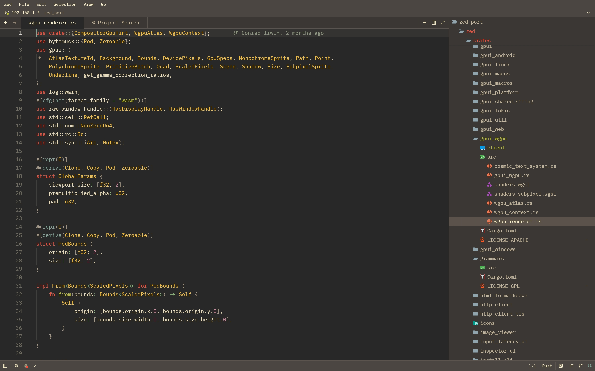
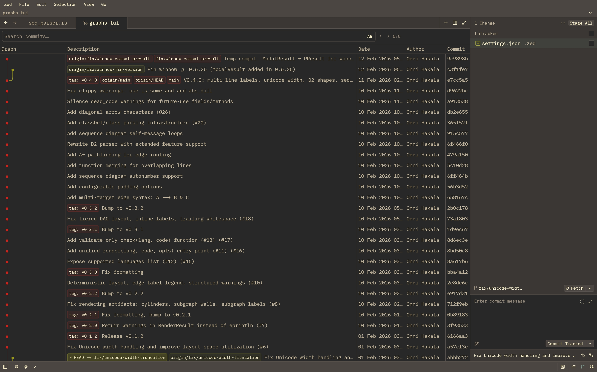
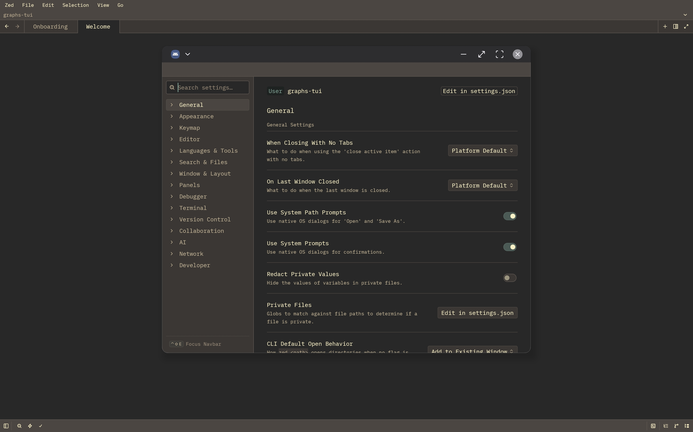

# Zed on Android

<p align="center">
  <em><strong>Zdroid</strong>. The actual <a href="https://zed.dev">Zed</a> editor workspace, project panel, multi-buffer editor, LSPs, terminal, git graph, extensions, remote SSH running natively on an Android tablet.</em>
</p>

<p align="center">
  
  
  
  
  
  
</p>

> **Proof of concept.** Not affiliated with Zed Industries. Might be highly unstable. See [Caveats](#caveats) for what doesn't work yet.
>
> _Soft fork of [zed-industries/zed](https://github.com/zed-industries/zed). Upstream README preserved as [`README.zed-upstream.md`](README.zed-upstream.md)._

---

<p align="center">
  <!-- TODO: hero gif. 45-60s loop: project open, search, terminal cargo
       build, claude in terminal, git graph. -->
  
</p>

Zed compiled from source for Android. gpui rendering with Vulkan via wgpu. The upstream `Editor`, `Workspace`, `Project`, `MultiWorkspace`, `Search`, `GitPanel`, `GitGraph`, `Extensions`, and `Terminal` crates running unchanged. Not a webview (no shade at electron). Bypasses termux + SSH to a server (since we have our own bootstrap). The actual Rust `.so` runs as the app process; gpui composites every pixel (yes, you read that right) directly via the Adreno Vulkan driver.

The trick was basically a custom `gpui_android` platform backend (Vulkan surface lifecycle, JNI bridges, touch and keyboard event translation) plus a Termux userland rebuilt under our package, `com.zdroid` (hence the unofficial name **Zdroid**, also the launcher label). apt, bash, git, ssh, node, go, openjdk, rust-analyzer all run inside the app's data dir. Everything else is upstream Zed.

---

##  &nbsp;What works

<p align="center">
  <table>
    <tr>
      <td></td>
      <td></td>
      <td></td>
    </tr>
  </table>
</p>

- **Editor.** Vulkan rendering, multi-pane workspace, vim mode, syntax highlighting, project panel, fuzzy file finder, command palette, buffer + project search.
- **Git.** Git panel with staging, full git-graph commit history, diff view.
- **Termux, in-process.** apt, bash, ssh, node, go, git, python, openjdk all native. No SSH bridge, no proot. Integrated terminal opens straight into it.
- **LSPs.** rust-analyzer baked in. gopls, ts-server, pyright, jdtls install in one `pkg`/`npm`/`go install`.
- **Extensions.** Browse, install, manage. Themes, language configs, grammars, slash commands.
- **Remote SSH.** Server-picker pill in the title bar, persisted server list, native askpass.
- **Claude Code.** `pkg install npm && npm install -g @anthropic-ai/claude-code`, then `claude` works.
- **Input.** Hardware keyboard, mouse, trackpad. Two-finger and long-press right-click.
- **Multi-window.** Android freeform and DeX, each extra window is a real Activity with OS chrome.
- **Edge-to-edge** rendering with content under the display cutout.
- **App menu bar** with nested submenus (Settings, Keymap, Themes, Extensions).
- **Theme follow** for system light/dark.
- **`ZedDocumentsProvider`** exposes the project root as a SAF volume, so other Android apps can browse Zed's worktrees.

---

##  &nbsp;Roadmap

Documented in [`crates/gpui_android/docs/workarounds/`](crates/gpui_android/docs/workarounds/). PRs welcome.

- Soft keyboard / touch IME bridge.
- 120Hz on 120Hz panels (currently 60Hz).
- Mailbox present mode, FrameMetrics, ALooper spurious-wake hunt, touch-event chain shortening.

Out of scope for this proof of concept: collab, AI panels, livekit voice. Cfg-gated to mocks so the binary still compiles. Cloud-account features that need backend integration anyway.

---

##  &nbsp;Tested on

Samsung Galaxy Tab S9 Ultra (Snapdragon 8 Gen 2 / Adreno 740, Android 16, One UI 8) is the daily driver. Compiles for any aarch64 Android 9+ with Vulkan 1.1, but only Adreno is exercised. Mali / Xclipse will run but may want shader tweaks.

A hardware keyboard is the supported config. Tablet plus Bluetooth keyboard, foldable in tablet mode, or DeX/desktop-mode with monitor and peripherals all work. Phones technically run but are de-prioritized; see [`docs/workarounds/deferred-phone-form-factor-polish.md`](crates/gpui_android/docs/workarounds/deferred-phone-form-factor-polish.md).

---

##  &nbsp;Install

```sh
adb install -r zed-android-<version>.apk
adb shell am start -n com.zdroid/.MainActivity
```

Or sideload via your file manager. Android prompts for unknown-source installs. First launch extracts a 250 MB Termux userland into the app's private data dir; takes about 30 seconds. Subsequent launches are instant.

---

##  &nbsp;Storage workflow

Android is strict with app storage. Two facts to know:

1. `/storage/emulated/0/` (Internal storage, linked at `~/storage/`) is FUSE-mounted noexec. Read/write/edit fine; the kernel refuses to `execve()` anything there. `cargo run` against a binary in `/storage/emulated/0/projects/foo/target/debug/foo` returns `EACCES`.
2. `/data/data/com.zdroid/files/` (app-private, exposed as `~/`) is exec-mounted. Same place Termux runs everything from.

So:

| Where | What for |
| --- | --- |
| `~/projects/<name>` | Default workspace root. `cargo new`, `git clone` etc. just work. |
| `~/storage/<shared,downloads,...>` | Curated symlinks into shared storage. For "open / edit / save a single file" workflows. Don't workspace-root these. |
| File → Import from sdcard… | SAF folder picker. Recursively copies into `~/projects/<basename>`. |
| Yellow "Builds won't run · Move" chip | Appears if you open a project on `/sdcard/` anyway. One tap copies into `~/projects/`. |

---

##  &nbsp;LSP install recipes

```sh
# Rust: baked into the bootstrap.
rust-analyzer --version

# Go.
go install golang.org/x/tools/gopls@latest

# TypeScript / JavaScript.
npm install -g typescript typescript-language-server

# Python (Pyright).
pkg install python && npm install -g pyright

# Java (jdtls). JVM-based, no native proxy needed.
pkg install openjdk-17 maven
# Then download jdtls from https://download.eclipse.org/jdtls/milestones/
# and add an `lsp.jdtls.binary.path` override in settings.json.
```

Themes, grammars, and language configs from the Extensions pane always work. Some extension-shipped binaries are glibc-only and won't run on Android (see [Caveats](#caveats)).

---

##  &nbsp;Build from source

You'll need:

- Rust toolchain with `aarch64-linux-android` (`rustup target add aarch64-linux-android`)
- [`cargo-ndk`](https://github.com/bbqsrc/cargo-ndk) (`cargo install cargo-ndk`)
- Android NDK r27 (`sdkmanager "ndk;27.0.12077973"`)
- Gradle 8+, `adb` on `$PATH`
- A device with USB debugging on

```sh
cd crates/gpui_android/examples/zed_android

ANDROID_NDK_HOME=/path/to/ndk/27.0.12077973 \
  cargo ndk -t arm64-v8a -P 26 -o android/app/src/main/jniLibs build

cd android
gradle assembleDebug
adb install -r app/build/outputs/apk/debug/app-debug.apk
adb shell am start -n com.zdroid/.MainActivity

adb logcat -d | grep -E "zed_android|RustPanic|FATAL"
```

First build is around 10 minutes. Incremental Rust rebuilds are 20 seconds, Gradle re-pack a few seconds.

---

##  &nbsp;Architecture

Deep-dives in [`crates/gpui_android/docs/workarounds/`](crates/gpui_android/docs/workarounds/). Highlights:

- **Termux rebuilt under `com.zdroid`.** apt/dpkg/bash userland with our package name baked into RUNPATHs and shebangs.
- **`/etc/resolv.conf` hex-patch.** Bun-compiled CLIs statically link c-ares with `/etc/resolv.conf` baked into rodata. We rewrite the literal in the binary's `.rodata` and in our musl libc to point at `/sdcard/.zed/r`, populated by JNI from `ConnectivityManager.getActiveDnsServers()`.
- **AChoreographer-driven vsync** via NDK FFI. No JNI hop per frame.
- **SAF integration** for picker → POSIX-path translation.
- **Multi-activity OS-chromed extra windows.** DeX freeform shows extra windows with Android's own task chrome.
- **`apply_runtime_patches`** stack at every boot: npm wrapper, launcher-gen patchelf, askpass helper, profile.d shim, DNS file refresh.

---

##  &nbsp;Caveats

This is just a proof of concept. No promises, might be highly unstable. The list isn't comprehensive.

- Soft keyboard not bridged. Hardware keyboard required.
- 60Hz on 120Hz panels. Haven't opted into 120Hz via `ANativeWindow_setFrameRate` yet.
- Some extension-shipped LSPs are glibc-only and won't run. JVM/Node/Python LSPs work via Termux's bionic runtimes.
- No collab / AI / livekit panels. Cfg-gated to mocks.
- Sandboxed storage. `/sdcard/` is FUSE-noexec; build inside `~/projects/`.
- MIUI / HyperOS aggressive battery management kills backgrounded Zed. Settings → Apps → Zed → Battery → "No restrictions".
- Tested on Tab S9 Ultra only. Mali / Xclipse not tried.

---

##  &nbsp;License

GPL-3.0-or-later, same as upstream Zed. The bundled `bootstrap-aarch64.zip` contains Termux-rebuilt packages, each under its own license (mostly BSD/MIT/Apache; gnupg/bash/coreutils are GPL). The Alpine-derived `ld-musl-aarch64.so.1` is MIT.

© Dylan Murzello, distributed under GPL-3.0-or-later. Zed itself is © Zed Industries.

---

##  &nbsp;Acknowledgments

- [Zed Industries](https://zed.dev/) for [`gpui`](https://github.com/zed-industries/zed/tree/main/crates/gpui) being platform-agnostic enough that an Android port is plumbing rather than a rewrite.
- [The Termux project](https://termux.dev/) for [a decade of Linux-on-Android](https://github.com/termux/termux-app). Most of our `apt install` machinery is their patches with the package name swapped.
- [Alpine Linux](https://alpinelinux.org/) for [musl libc](https://musl.libc.org/), which lets Bun-compiled musl binaries (claude-code, codex) execve cleanly on bionic.
- The [`wgpu`](https://github.com/gfx-rs/wgpu) and [`blade-graphics`](https://github.com/kvark/blade) maintainers for a Vulkan abstraction that just works on Adreno.

---

##  &nbsp;Contributing

Issues, screenshots, hardware reports, and PRs welcome. Read [`crates/gpui_android/docs/workarounds/README.md`](crates/gpui_android/docs/workarounds/README.md) before adding a platform shim. Good chance the issue you're hitting has a documented workaround already, with the constraint that ruled out the obvious fix.

---

##  &nbsp;So why this ?

Zed Industries' position on a mobile/tablet port: **not planned**.

- [#12039 IOS/Android Port](https://github.com/zed-industries/zed/issues/12039), open since May 2024.
- [#34633 start of termux build](https://github.com/zed-industries/zed/issues/34633), closed as "not planned" in Jul 2025.
- [#43207 gpui: On Android](https://github.com/zed-industries/zed/issues/43207), open in the GPUI Roadmap as "Wide Scope" since Nov 2025.

This repo is what those threads were asking for, built independently. The Termux build attempt failed because the upstream `wasmtime`/`cranelift` deps don't compile inside Termux. We sidestep that by building the APK on a desktop with `cargo-ndk` and running our own custom Termux userland in process. No fork of upstream-Zed-with-android-cfg is needed; the Editor, Workspace, Project, Search, GitGraph, Terminal, Extensions crates run unchanged. The work is at the platform boundary, documented in [Architecture](#architecture).
